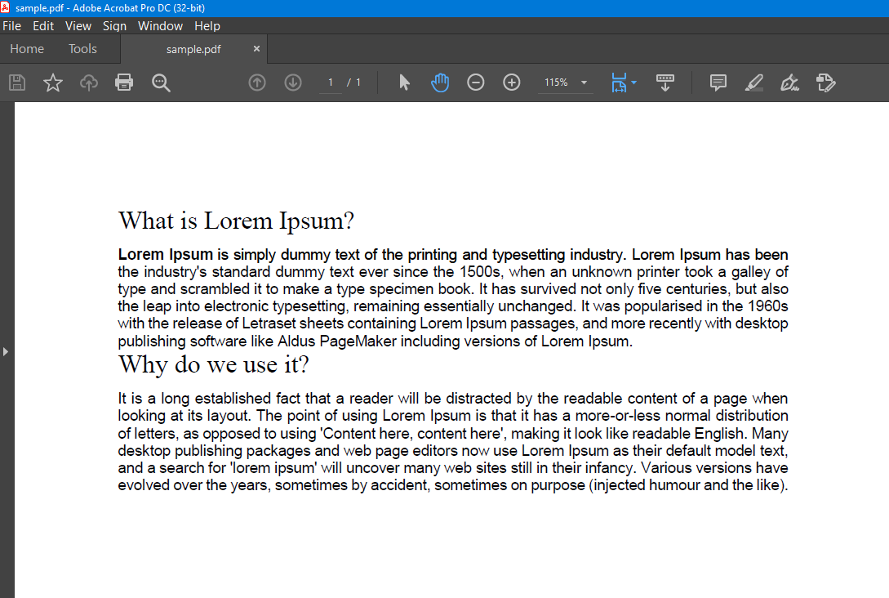
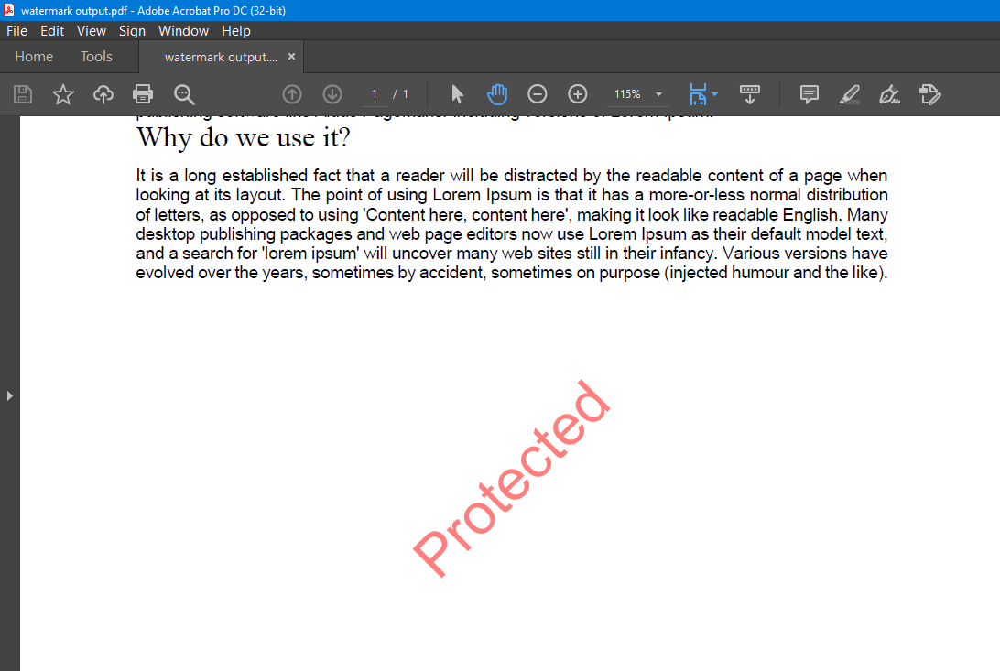

# Watermark A Document 
This application elaborates how GroupDocs.Watermark for .NET [API](https://products.groupdocs.com/watermark/net) could be used to add Watermarks in a document using Visual Basic. 

### How to Run
* Download or clone the project
* Restore NuGet package
* Build and run application

Don't have the API subscription? You can request a [temporary license](https://purchase.groupdocs.com/buy) and run this demo application without any [trial limitations](https://docs.groupdocs.com/watermark/net/evaluation-limitations-and-licensing/). 

## Screenshots
* Source File 
 
* Resultant File

# Interested in GroupDocs free consulting project?
[If you are also interested in a free consulting project by GroupDocs team then please view details on this page](https://github.com/groupdocs-free-consulting/)

If you have any questions about GroupDocs APIs, please feel free to post your query in [GroupDocs Forum](https://forum.groupdocs.com/).

Also, you can keep in touch with the latest developments in file format APIs offered by GroupDocs at our [Blog](https://blog.groupdocs.com/).

